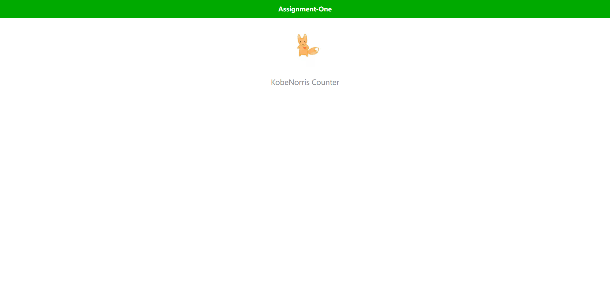
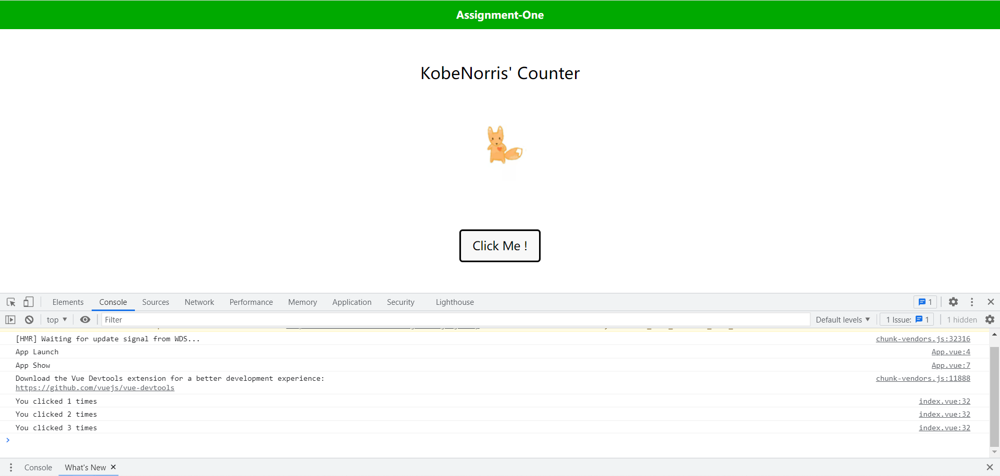
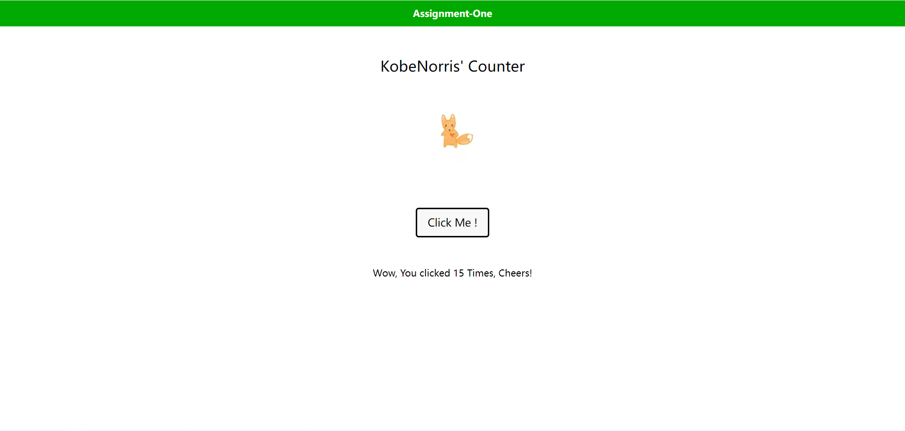
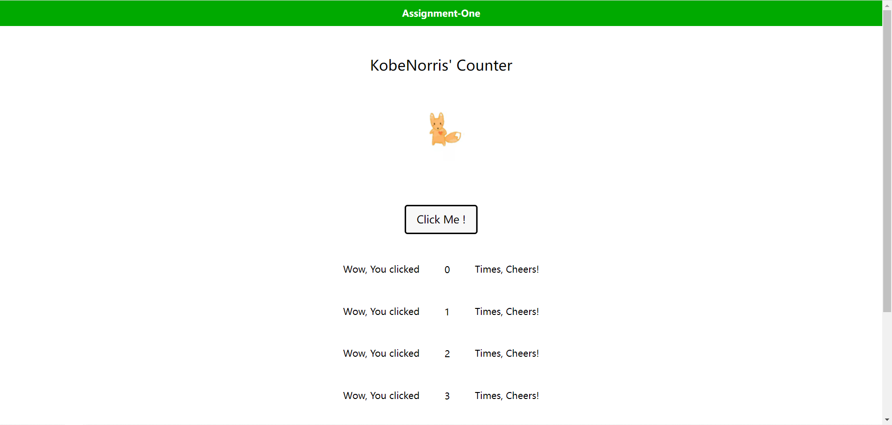

# Assignment

## 1. 小节练习 1 - 1

Uni-app_使用及调试

按照 guidance 在自己的电脑上

1. 安装 HBuilder X
2. 创建 名为 **AssignmentOne** 的 Uni-app 项目
3. 创建屏蔽跨域检测机制的 Chrome 浏览器
4. 运行 名为 Demo 的 Uni-app 项目
5. 【Bonus】研究并理解为什么要设置 CORS 机制

## 2. 小节练习 1 - 2

Uni-app 及 Vue.js 的结构

通过学习 **guidance** 和完成 **练习 1 - 1** 完成以下步骤

1. 在 `pages.json` 中改变 `navigationBar` 的颜色和内容
   
    
    
2. 将 data property 内的 title 内容改变为 ”XXX's Counter“ ( XXX 为你自己的名字 ) 并将 logo 替换为自己喜欢的图片，静态文件需要放在 `static` 文件夹下面
   
    
    
3. 调整 `style` 和 页面布局
   
    
    
4. 在图片下方加上一个 `button` 元素， text message 为 "Click Me !"
   
    
    
5. 在实例的 `mounted` 钩子函数上挂载一个 `greeting()` 函数，让每个页面访问者都可以享受到 **肮脏** 而又 **恶心** 的原生 `alert()` greating 服务
   
    
    

## 3. 小节练习 1 - 3

Vue 模板语法

通过学习 **guidance** 和完成 **练习 1 - 2** 完成以下步骤

1. 使用 `v-on` 将 data property 中的一个属性值与该 `button` 的 `click event` 进行绑定，每点击一次，该值 increment 一次
   
    
    
2. 使用 **插值** 将该值打印在你的页面中，响应式地更新该值，并使用 `v-if` 在未点击 `button` 前不显示这一句话
   
    
    
    
    
3. 使用 `v-on` 和 `input` 元素将页面内的值 **反向绑定** 到 data property 内对应的属性上 （具体方法在课件中展示过）
   
    
    
4. 将每次 data property 内对应属性值的变化记录下来，并使用 `v-for` 将其全部打印在页面上
   
    
    

## 4. 课后作业 1 - 4

一个稍微大 **亿亿** 点的 Uni-app 项目

一个登录查询物流信息的网站 "XXX Devliery Service"

1. 网站由两个模块组成
    1. 一个让用户输入 **单号** 的小窗口
       
        
        
    2. 展示物流 **信息** 的页面
       
        
    
2. 网站的运行流程是
    1. 用户输入 **单号** 并从本地查询具体物流信息
        1. 本地物流信息会以 JSON 文件形式，放在 `static` 下面
           
            [sampleDeliveryData.json](Assignment/sampleDeliveryData.json)
            
        2. 用户输入单号后单号输入页面会消失，考虑使用 `v-if` 实现
    2. 将查询到的物流信息展示给用户
3. 可以自行增加功能和样式
    1. 例如实现除了单号查询以外的查询方式
    2. 例如增加用户登录界面

                                                                                                                                        By KobeNorris