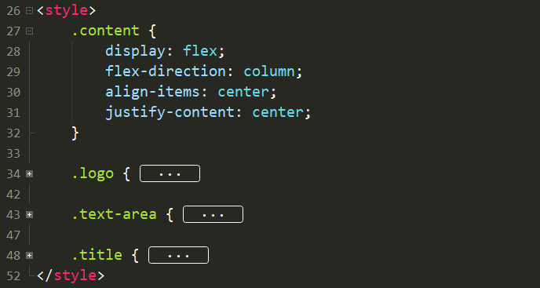

# Uni-app 及 Vue.js 的结构

## 1. Uni-app 项目结构

这是我们刚刚创建的 Uni-app 项目 :


1. `.hbuilderx` 是 IDE 自己的生成的启动文件，主要用于修改及定义启动项目的具体类型和方式
2. `pages` 用于存放 Uni-app 的网页文件，你所有的 **主页面**（不包括导航栏设置）以及 **组件** （我们下一节课会涉及）都应按各自职能放在 pages 下的不同文件夹内
3. `static` 用于存放 uni-app 的网页静态文件，包括但不限于 **图片** ， **音乐** ， **测试数据包** 等 非动态文件，亦可理解为 resource 文件
4. `App.vue` **Vue 项目的入口文件**，管理页面的切换，因而可用于定义所有页面中共同需要的动画或者样式
5. `main.js` **Uni-app 项目的入口文件**，主要用于初始化 Vue实例 ，定义全局组件
6. `manifest.json` 管理 app 的基础配置，包括但不限于 **图标** ， **界面** ， **模块** 及 **权限 配置** 等
7. `pages.json` 用于对 uni-app 进行**全局配置**，决定**页面文件的路径** ，**窗口样式** ，原生的**导航栏** ，底部的原生**tabbar** 等
8. `uni.scss` 定义 uni-app 内置的常用样式变量

## 2. Vue 框架结构

以我们刚刚创建的 `Demo/pages/index/index.vue` 为例，Vue 文件多由三部分组成

 

1. `<template>` **→** HTML内容模板元素
   
    
    
    1. 可以暂时理解为页面文件，类似 HTML；
    2. `<template>` 内部有且只能有一个 Root 元素，可以是 `<view>...</view>` 也可以是 `<div>...</div>` 
    3. 在 Vue 框架下不推荐直接操作 DOM ，因为 **高耦合** + **不可预测** + **低性能**
2. `<script>` **→** JS
   
    
    
    1. 在 `data() { ... }` 中定义了该组件的属性
        1. 为什么是个函数 : 因为在渲染过程中生成的是 Vue 实例，因而每个属性都需要是新生成的属性，而不是所有模块共用一套属性；
        2. `data() { ... }` 中 `this` 指向当前实例
    2. Vue 的每个模块都有自己的 **生命周期** ， 我们会在之后讨论
    3. 在 `methods: { ... }` 中可以加入自定义的 JS 函数
3. `<style>` **→** CSS
   
    
    
    1. 类似 CSS，再次略过不做赘述

## 3. Vue 实例的生命周期

每个 Vue 应用都是通过用 `createApp` 函数创建一个新的应用实例开始的，而每一个实例被创建时都要经过一系列的初始化过程。同时在这个过程中也会运行一些叫做生命周期钩子的函数，这给了用户在不同阶段添加自己的代码的机会 ：


1. beforeCreated
2. created
3. beforeMount
4. mounted
5. updated
6. activated
7. deactivated
8. beforeUnmount
9. unmounted
10. errorCaptured
11. renderTracked
12. renderTriggered

### E.g. Created

```jsx
Vue.createApp({
  data() {
    return { count: 1}
  },
  created() {
    // `this` 指向 vm 实例
    console.log('count is: ' + this.count) // => "count is: 1"
  }
})
```

1. 生命周期钩子的 `this` 指向调用它的当前活动实例，因此你可以访问当前实例下的 `data` ，`computed` 和 `methods` ；
2. 不同生命周期钩子调用时实例处于不同状态，如 `created` 数据侦听、计算属性、方法、事件/侦听器的回调函数已被配置完毕。然而，挂载阶段还没开始，且 `$el property` 目前尚不可用；
3. 更多详见 
   
    [生命周期钩子 | Vue.js](https://v3.cn.vuejs.org/api/options-lifecycle-hooks.html)
    

                                                                                                                                        By KobeNorris