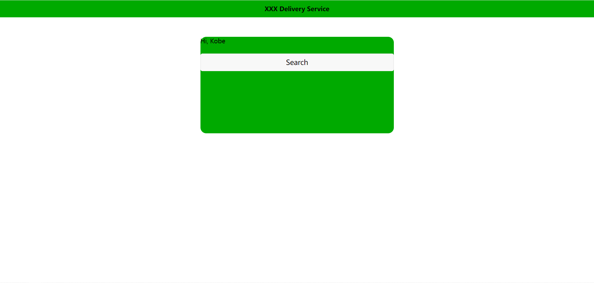

# Assignment

## 1. 小节练习 2 - 1

Vue 组件基础和模块

通过学习 **guidance** 和完成 **课后作业 1 - 4** 完成以下步骤

1. 将 让用户输入单号的窗口 组件化

## 2. 小节练习 2 - 2

Vue 组件交流

通过学习 **guidance** 和完成 **练习 2 - 1** 完成以下步骤

1. 通过 `props` 将 `index` 中的变量打印在 window 上
   
    
    
2. 通过 `emit` 将 window 的输入返回 `index` ，并实现搜索功能
   
    
    

## 3. 小节练习 3 - 3

Axios 和 Promise

通过学习 **guidance** 和完成 **练习 2 - 2** 完成以下步骤

1. 通过 `axois` 直接从 icewould 的 API 取数据

                                                                                                                                   by KobeNorris