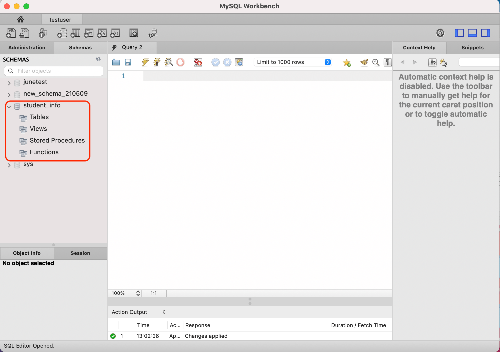
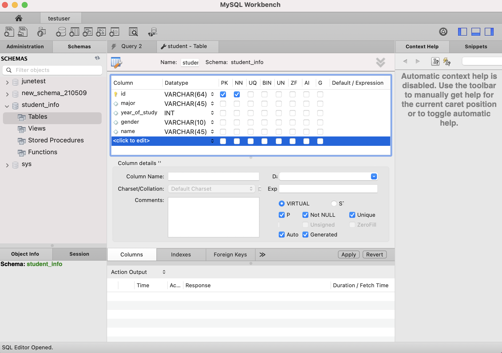
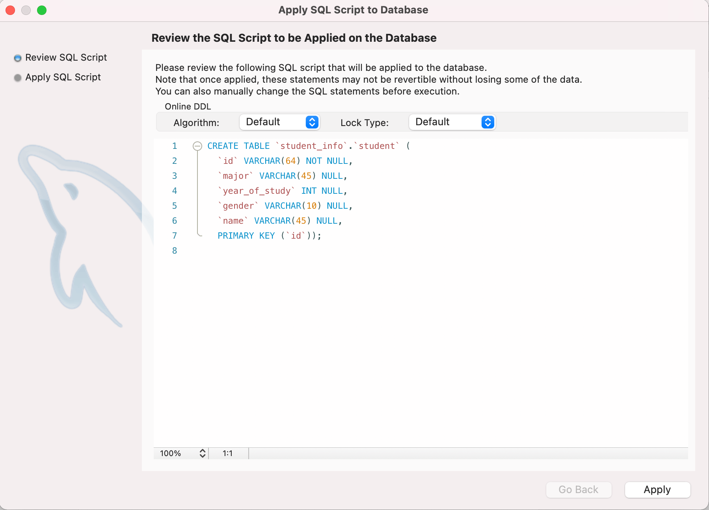
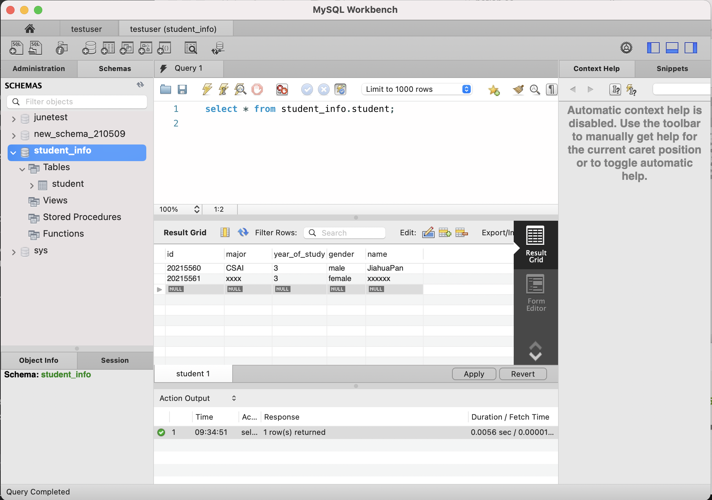

# 数据库_使用

数据库 + MyBatis + 增删改查

## 本节课学习的内容

1. 使用 `MySQL Workbench` 创建一个数据库，用来保存 `student_info` 。需要考虑每个值用哪种数据类型保存。
2. 在本地打开 `MySQL` 服务。

## 数据库以及管理系统的安装

### MySQL

[Windows安装MySQL](https://www.runoob.com/mysql/mysql-install.html)

[Mac安装MySQL](https://www.jianshu.com/p/07a9826898c0#:~:text=mac)

### MySQL Workbench

MySQL Workbench可以让我们以可视的方式对数据库进行配置、修改等操作，可以更方便的管理用户，更加方便直观。

[Windows安装MySQL Workbench](https://jingyan.baidu.com/article/64d05a0299582c9f54f73b25.html#:~:text=点击“MySQL%20Installer%20for,Windows”%2C再点击拓展名为msi的下载程序，也可以点击Archives，进入历史版本下载界面%E3%80%82%20双击下载完成的安装程序，选择“Full”，这样就能把MySQL%20Workbench一并安装%E3%80%82)

[Mac安装MySQL Workbench](https://jingyan.baidu.com/article/0964eca2409e9a8285f5369d.html#:~:text=在Win安装MySQL的时候，可视化图形界面操作MySQL的Workbench会一起安装，而Mac则需要另外安装，本节介绍，Mac下载安装%20MySQL%20Worbench,的方法，具体如下%20在百度上打开%20MySQL官网，找到Workbench下载安装即可，官网：https%3A%2F%2Fdev.mysql.com%2Fdownloads%2Fworkbench%2F，点击下载安装包，具体如下图)

### 安装完mysql后创建新用户（之后要用到）

打开终端

Windows输入

```jsx
	mysql -u root -p
```

Mac输入

```sql
	/usr/local/mysql/bin/mysql -u root -p
```

输入密码

进入到mysql

```sql
CREATE USER 'testuser'@'localhost' IDENTIFIED BY 'password';
```

创建了名为‘testuser’的用户，此账户可以用testuser登陆

这边不一定要取testuser，想取啥名字取啥名字。

一定一定要记住密码！！！

### 给新用户赋予权限

```sql
grant all on **.** to 'testuser'@'localhost';
```

此时testuser拥有了对此数据库操作的一切权限。

打开MySQL Workbench，点击MySQL connections左边的➕，创建新的连接。


点击ok后回到开始界面，点击你刚刚创建的连接，并输入testuser的密码，进入到此连接


点击上方创建新的schema，创建新的数据库空间，并命名为任意名称。


点击apply，此时，我们可以看到左边schema表中已经出现了我们刚刚新建的schema，此时，schema中还不包含任何的数据表



于是我们右键点击Create Table创建数据表，并输入数据表中所包含的项目以及其类型。

VARCHAR是可变长度的字符串。

Char是固定长度的字符串。

INT为整型。

[更多数据类型](https://www.runoob.com/mysql/mysql-data-types.html)可参考



点击Apply创建刚刚定义的数据表。



我们可以看到左边schema栏中已经出现了我们新建的数据表

在Query界面输入以下代码，并点击上方⚡️execute按钮

```sql
use student_info;      --  选取student_info这个schema
show tables;           --  显示当前schema中的数据表
select * from student; --  显示student这个数据表中所有的数据
```


下方Result栏会返回我们每一行执行命令的Result Grid，我们可以通过action output区域判断我们命令是否被正确的执行。

因为当前我们没有向student表中加入任何记录，所以我们查询到一个全空的表。

我们可以选择直接在result grid中输入你想要加入的记录，点击apply来添加记录


也可以选择在Query中输入insert命令来增加记录

```sql
INSERT INTO student_info.student (id, major, year_of_study, gender, name) VALUES ('20215560', 'CS', '3', 'male', 'JiahuaPan');
```

点击⚡️运行后，再输入以下命令显示student表中内容可以发现，新的记录已经被添加到该表了。


如果要修改表内的信息的话，例如将id为20215560的记录的major由CS改为CSAI，在query中输入upadte命令。

```sql
UPDATE student_info.student SET major = 'CSAI' WHERE (id = '20215560');
```


可以看到修改成功。

大家自己尝试添加修改几项。


要对特定符合某个条件的记录进行搜索的话，我们会使用 where 来添加限制条件。例如

```sql
select * from student_info.student where id='20215561';
```

可以搜索出该表中id为20215560的项。



如果要进行删除记录操作的话，例如删除最后一条记录。

```sql
**DELETE FROM student_info.student WHERE (id = '20215562');**
```


此时我们可以看到最后一条记录已经被删除掉了。

大家可以自己尝试一下增删改查的用法