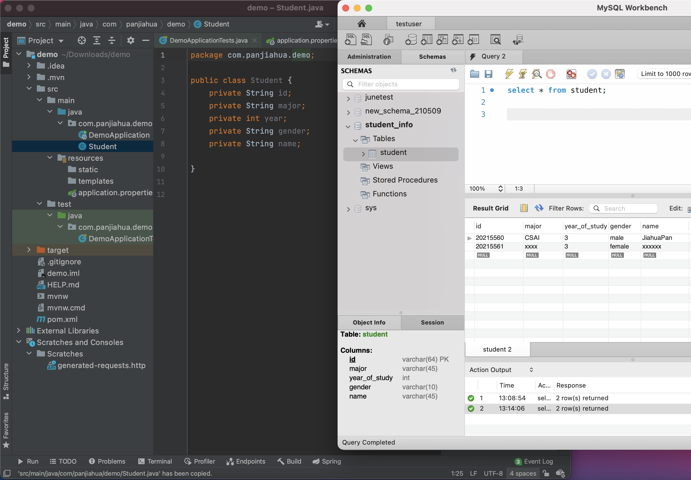

# Spring Boot+Mybatis使用

在上次课我们已经建造了一个数据库并向其中添加了一些记录。

## 本节课学习的内容

1. 配置 `Mybatis`。
2. 实现三个接口 `/product/get` 和 `/product/add`，`/product/delete` 来操控数据库，进行获取、添加和删除信息的操作。
3. 把 `MySQL` 服务以及 `SpringBoot` 服务部署到自己的云服务器上（请搜索该怎么做），然后更改配置。

## 连接数据库

在src/main/resources/application.properties这个文件中加入

```tsx
spring.datasource.url=jdbc:mysql://localhost:3306/<schema的名字>?serverTimezone=UTC&useUnicode=true&characterEncoding=utf-8&useSSL=true
spring.datasource.username=<MySQL的用户名>
spring.datasource.password=<MySQL的密码>
spring.datasource.driver-class-name=com.mysql.cj.jdbc.Driver

server.port=8080        #端口可以随便写，但是如果之后要部署到服务器上的话建议8080
```

## 创建类(Class)

相对应上节课做的数据表，我们需要在Java中新建一个Class，使之与数据表中的数据类型对应，这样才能把之后从数据库取得的数据暂时存在内存中。

在`src/main/java/com/<网站前缀>/demo/`中新建`Student.java`。

```java
public class Student {
		private String id;       // 这边private的原因是因为不让用户可以直接访问到其中的信息，使其更加安全
    private String major;
    private int year;
    private String gender;
    private String name;
}
```



**注意：请为全部五个字段加入 `getter` 和 `setter`**，否则会造成无法正常读取或者写入信息。用 `IntelliJ` 的话，可以在 `.java` 文件里按下 `Alt + Insert`(Windows)、`Command+N`(Mac)选择 `Getter and setter`，按住 `Shift` 选中所有的类，自动添加。


添加完成后的结果是这样。


## 接口（Mapper）

我们还需要用`MyBatis`去访问数据库，在最开始配置的时候我们已经成功连接了数据库，我们还需要建立接口用来获取数据库中的数据，此时我们需要用到`@Mapper` 注释。

在`src/main/java/com/<组织名>/demo/`下新建StudentMapper.java的interface，并使用`@Select` 注释。

```java
@Mapper         // 作用：在接口类上添加了@Mapper，在编译之后会生成相应的接口实现类
// 可以告诉spring boot这个接口实现类由Mybatis负责创建，并将其实现类对象存储到spring容器中。
//说人话就是让Spring Boot用My Batis获取数据库中内容，并保存在内存中
public interface StudentMapper {

		// @方法名+语句就可以使用对应的mysql的操作。
    @Select("Select * from student;")
    List<Student> listAllStudent();

}
```

## 控制器（`Controller`）

做了上面那些工具以后，我们还需要从外界接收请求的内容，于是我们就需要一个Controller来获取网页请求。`@RestControlller` 可以用来处理Http请求，`@Resource` “”“”“”，`@GetMapping("/studentlist")`等价`@RequestMapping(value="/studentlist",method=RequestMethod.GET)`,接收到面对"student list"的Get请求，执行以下功能。

```java
package com.panjiahua.demo;

import org.springframework.web.bind.annotation.GetMapping;
import org.springframework.web.bind.annotation.RestController;

import javax.annotation.Resource;
import java.util.List;

@RestController
public class StudentController {

    @Resource
    StudentMapper studentmapper1;

    @GetMapping("/studentlist")
    public List<Student> getStudentList(){
        return studentmapper1.listAllStudent();
    }

}

```

重新点击运行

访问[http://localhost:8080/studentlist](http://localhost:8080/studentlist)，可以看到以列表的形式呈现着数据库中的数据。


## 处理带有参数的请求

刚刚学习的返回数据库中信息的操作，直接访问该网页就会返回数据库中的内容，那么我们要如何向数据库中添加一条新的记录呢。这时候我们就需要用到`@RequestParam`对其网址进行分析

```java
@GetMapping("/studentbyyear")        //
public List<Student> getStudentByYear(@RequestParam(value="year",defaultValue = "2") int year){
		@RequestParam
    return studentmapper1.findStudentByYear(year);
}
```

碍于篇幅所限，本文无法再介绍更多内容，以下内容列出了常用的标识，可供读者参阅和尝试：

- Insert
- Update
- Delete

更多的内容，请于网上参考资料，本文将不再过多叙述。