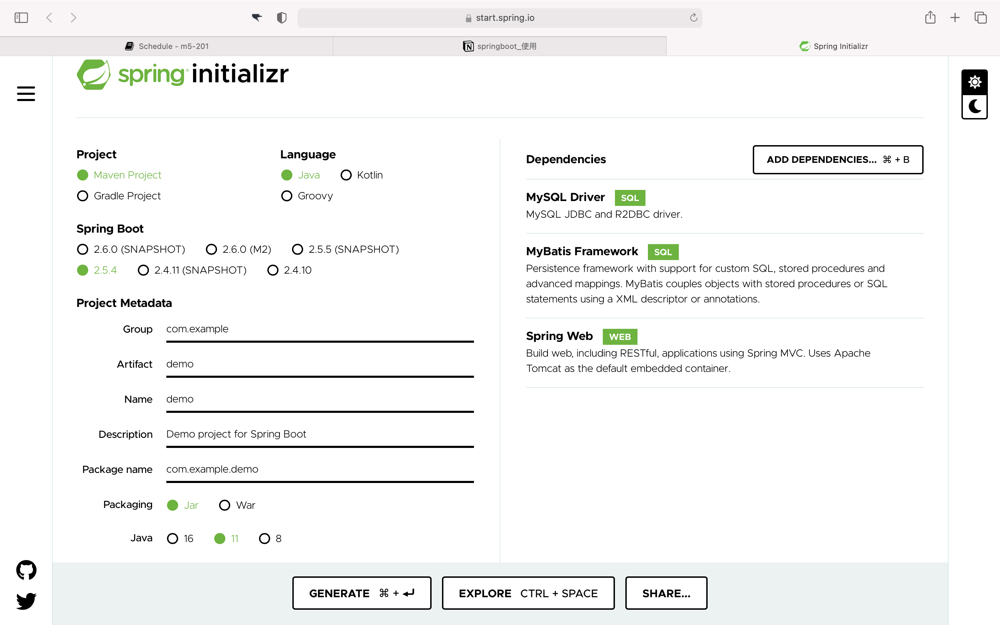
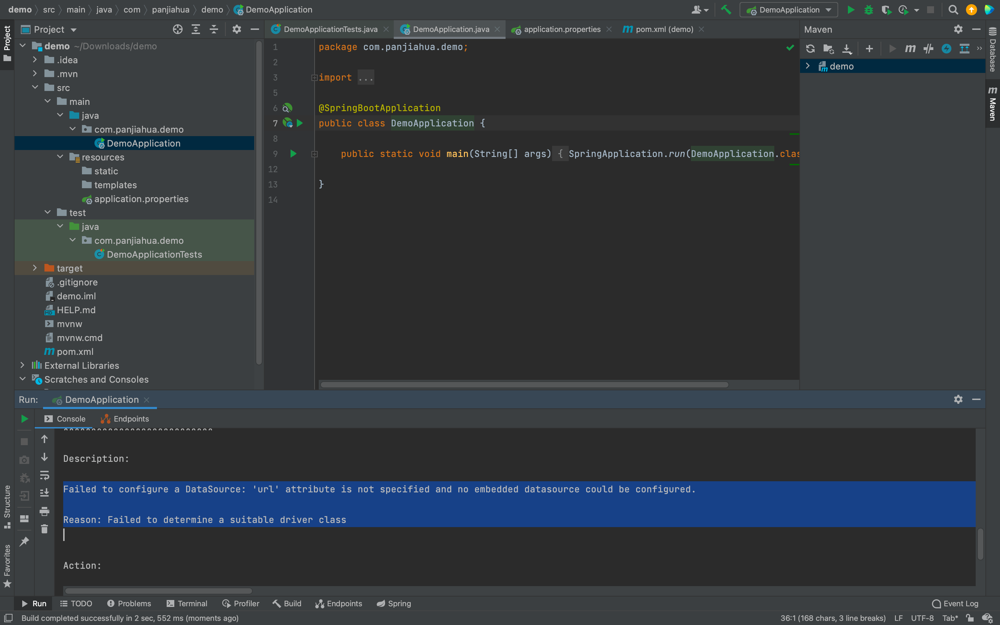
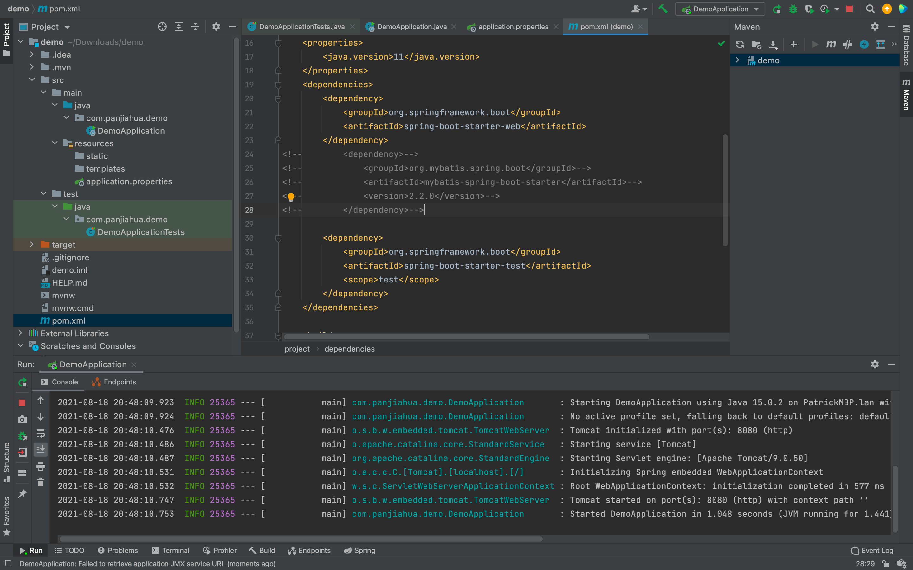
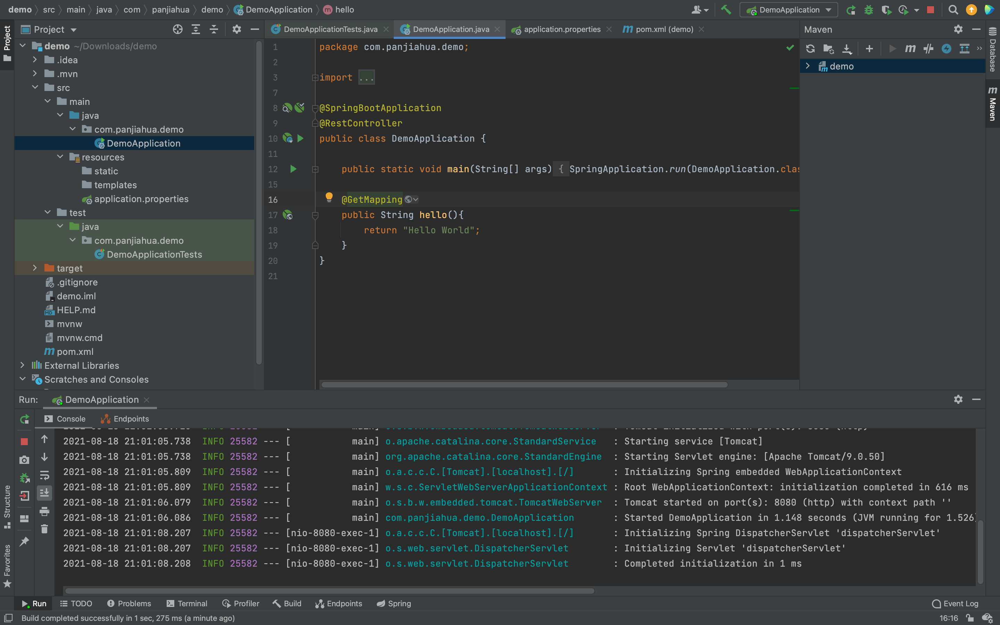

# springboot_使用

## 本节课的学习内容

在这个教程中，我们会带大家intelij来编写一个简单的后端。

# **准备工作**

首先，强烈推荐 [IntelliJ](https://www.jetbrains.com/idea/)。注意，请下载 `Ultimate` 版，这样才能获得 `Spring` 的完整支持！下载的同时，请从[这里](https://www.jetbrains.com/shop/eform/students)用学校邮箱申请免费使用，**白嫖yyds**！

~~如果你有生产力需求的话，也可以选择花个1000多买个全家桶~~

## SpringBoot该如何配置

使用[spring initializer](https://start.spring.io)可以简化你配置的步骤

按如下图片进行设置

用`Maven`架构来管理包，下面group地方就把自己域名反一反写上去，`Spring Boot`提供了http集成，`My Batis`是用来连接数据库的，`MySQL Driver`是用来对数据库中内容进行操作的。

完成后点击generate



会下载一个zip文件，解压后拖动到Intelij IDEA`Intelij IDEA`中打开，等待它自动下载所需文件

`Resource`文件夹中的static和templates是有关网页显示的，

此时点`aDemoApplication`右侧的运行按钮，会报出fail to configure a datasource.我们暂时还没有连接数据库所以会报出这样的错误。



此时注释掉如下几行，并且点击右上方的刷新按钮，maven会自动将mybatis给忽略（mybatis是连接数据库的包）

此时再点击运行，一切正常



观看下方运行信息，发现本服务在8080端口跑，访问[http://localhost:8080](http://localhost:8080) ，因为你未在其中添加任何内容，所以出现空白页面错误。


添加如下代码到`DemoApplication`文件中，点击运行

`@RestController` 等价于

`@GetMapping`等价于`@RequestMapping(value=“/”,method=RequestMethod.GET)`,

相当于面对用户发送的面向“/”的get请求，他会返回一个字符串类型，内容是“Hello World”



此时再访问[http://localhost:8080](http://localhost:8080)，则显示出hello world


如果我们要让[localhost:8080/list/](https://localhost:8080/list/)这个网站返回一个列表该怎么办呢。大家可以先自己写一写。

再输入以下内容,点击运行

`@GetMapping("/list"）`等价`@RequestMapping(value="/list",method=RequestMethod.GET)`,

相当于面对用户发送的面向"/list"的get请求，他会返回一个列表类型，内容["Hello","World"]


此时再访问[http://localhost:8080/list](http://localhost:8080/list)，则显示出["Hello","World"]


返回其他任何类型的数据也是同理。

若要能随着用户输入信息发生变化时，则要用到`@RequestParam`来获取用户输入，添加以下代码到`DemoApplication`，参数中的`value`就是参数名，`defaultValue`就是没有输入情况下默认的输入值。

```java
@GetMapping("/hello")
public String Hello(@RequestParam(value = "username", defaultValue = "UnknowUser") String user_name){

   return "Hello, "+user_name;

}
```

运行再访问[localhost:8080/hello?username=your_name](http://localhost:8080/hello?username=your_name)，此时可以看到页面上出现了刚刚输入的内容。

