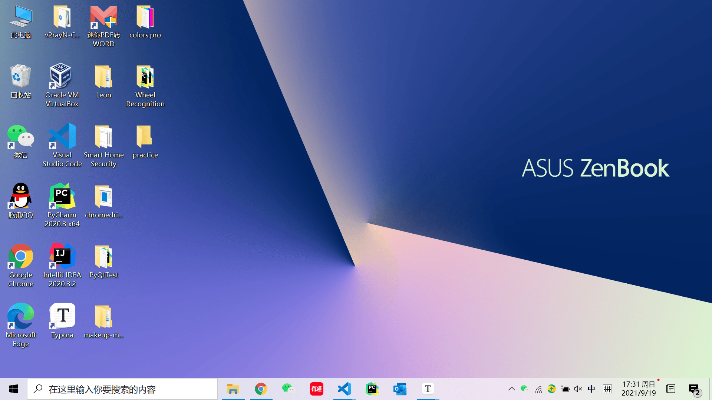
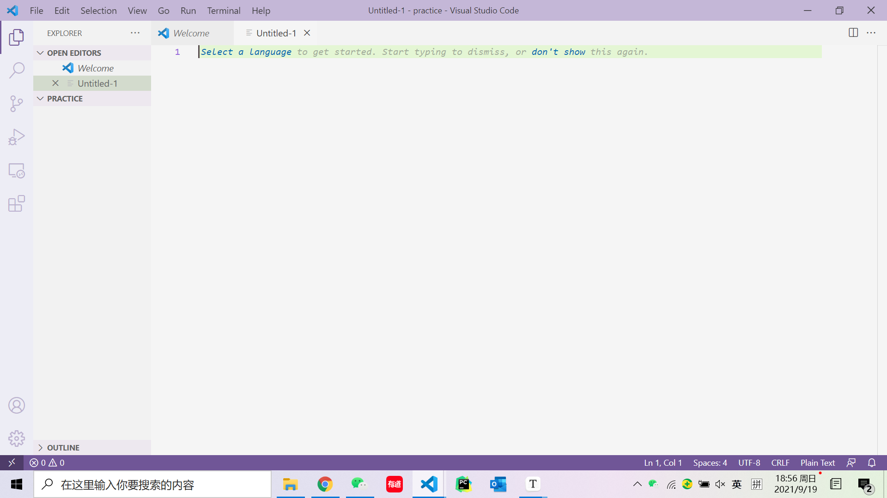
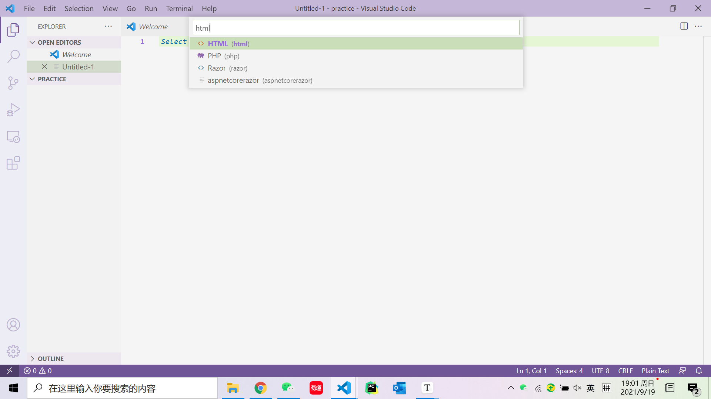

# Web 练习


## 准备工作

在写代码前，首先我们需要一个比较智能的代码编辑器。当然，系统自带的记事本也是代码编辑器，只是没那么“聪明”，不能够给你很多提示，相对来说比较麻烦。所以今天向大家推荐**Visual Studio Code**（**VS Code**），可以从[这里](https://code.visualstudio.com/Download)下载。

另外，在投身于代码“创作”前，我们还是先明确一下最终要实现的目标比较好：


可以看到，在网页的居中位置有一个黑底白字写着***New Button***的按钮，以及一个矩形的框。当点击按钮后，框内就会生成一个红色的小方块，并以每秒一格的速率下落，一直到消失。

其实这就是在做**俄罗斯方块**的游戏，只不过我们没有做出俄罗斯方块的各种形状，没有做出控制方块做左移右移、顺时针转逆时针转的逻辑，没有做出方块落到最底下堆积和堆满一行消除的逻辑。虽然听起来什么都没做的样子，但是麻雀虽小，五脏俱全，实现这个幼年版俄罗斯方块就要用到我们在**Notes**里讲到的**Web三件套**了。接下来就让我们用它们一步一步实现这个简陋的**"201方块"**。


## 开始冻手


#### 基础架构

首先，要明确的是，做这个网页我们总共需要三个文件，一个**HTML**文件，一个**CSS**文件以及一个**JavaScript**文件。当然像**Notes**里提到的，借助**内部引入**或者**行内引入**的方法，其实仅仅用一个**HTML**文件也够，但是为了让三件套的分工看起来更清楚，且便于日后的阅读与修改等等，我们还是建议使用三个分别的文件。

所以我们需要先找一个地方（最好是比较好找的地方）创建一个文件夹，名字随便取，我们这边命名为**practice**。当然也是一样的道理，不创建文件夹固然可以，但是为了看着清楚，我们最好还是用一个文件夹来存放构成一个网页的各个文件。


然后打开安装好的**VS Code**,点击菜单栏的**File**选择**Open Folder**,并在随后选择刚刚创建的文件夹。


创好文件夹后，我们继续创建之前说的三个文件。同样的，也是在菜单栏的**File**里，点击**New File**(或者直接```ctrl```+```N```)。


然后我们可以点击编辑器在第一行自动提示的**Select a language**来选择这个文件中代码的种类。







随后我们便可以```ctrl```+```S```保存这个文件了。


上面展示的是**HTML**文件的创建，但另外两个文件的创建也是同理。在都创建完毕后，我们应该有这三个文件：


到这里为止，组成网页的文件的基本架构就完成了。那么接下来就让我们一个文件一个文件地完成201方块。


#### HTML

就像**Notes**里说的一样，**HTML**指定了**每个元素在网页中的位置这样最基础的网页结构**，所以我们从**HTML**文件写起。

首先我们把一个**HTML**最基本的结构写出来，就像下面这样：

```html
<!DOCTYPE html>
<html>

<head>
</head>

<body>      
</body>

</html>
```

我们知道，```<head>```里可以**指定整个文档的公共资源**，所以我们就在这边指定外部引入的**CSS**文件和**JavaScript**文件：

```html
<head>
    <link rel="stylesheet" type="text/css" href="201tetris.css">
    <script type="text/javascript" src="201tetris.js"></script>
</head>
```

其中```href```和```src```后面跟的分别是**CSS**文件和**JavaScript**文件的路径，由于都是在同一个文件夹下，所以这边直接写文件名字就好了。

然后我们需要在```<body>```部分**定义页面上的元素**，也就是一个按钮和一个矩形框了：

```html
<body>
    <div id="buttonContainer">
        <button id="startButton" onclick="play()">New Game</button>
    </div>
        
    <div id="gameBoard"></div>
</body>
```

这边出现了一个大家可能没见过的标签，也就是```<div>```，即**HTML**文档分区元素。在不使用**CSS**的情况下，它对页面的布局没有影响。通俗地来讲，它就是一个无形的容器，其中包含的就是```<div>```标签里的其他**HTML**元素。

可能大家会有些疑惑，既然它是一个无形的容器，那我们为什么要用它？确实在我们练习的例子中，直接声明一个按钮也能达成一样的效果，但是这就要讲到```<div>```的一大优势了：当代码量比较大，网页上元素很多的时候，我们往往需要分区处理它们，```<div>```和**CSS**结合运用，就可以通过画出边界或是调整背景色等，很好地对网页进行分区。

在上面的代码中，我们定义了两个分区，其中第一个id为**buttonContainer**的分区包含了id为**startButton**的按钮，而第二个id为**gameBoard**的分区则代表了矩形框所占的区域。而其中按钮的点击事件（就是点击后发生的事情）被我们指定为了**play()**。所以写完**HTML**文件后，接下来的目标也就明确了——我们需要在**CSS**文件中定义id为**buttonContainer**、**startButton**以及**gameBoard**的元素的特性，并在**JavaScript**文件中定义**play()**函数。


#### CSS

首先我们先写id为**buttonContainer**的分区的**CSS**特性，由于我们只用这个分区来包含按钮，所以我们只是希望通过它来确定这个包含按钮容器本身的宽度以及它与其他分区元素的边距，这样的功能可以通过下面的代码实现：

```css
#buttonContainer {
    width: 200px;
    margin: 20px auto 20px auto; 
}
```

其中**width**指定了这个元素的宽度为200px（也就是200个像素）；而**margin**的四个值分别对应上边距、右边距、下边距和左边距（也就是顺时针转过来的四个边距）。这里我们指定上下边距都为20px，让这个容器不会和网页的最上面以及下面的矩形框贴在一起；左右边距为**auto**，这个**auto**的意思就是让元素占据所有的可用空间，所以我们如果单让左边距为**auto**的话，就会让容器右对齐，因为左边距占据了除了容器本身占用宽度外的所有宽度，同理如果只设置右边距为**auto**，容器就会左对齐，而当我们同时设置左右边距为**auto**的话，就会让左右边距相等，使得容器居中。不过这里需要注意的就是，如果不定义容器的宽度，那么它的宽度就会默认为是父元素的宽度，也就是整个页面的宽度，这时候它就会独占一行，而不是在页面上水平居中。

然后我们再来写id为**startButton**的按钮的**CSS**特性，也就是定义它的宽高、边框以及它为黑底白字的特性的代码：

```css
#startButton {
    width: 200px; 
    height: 40px; 
    background-color: black; 
    color: white; 
    border-radius: 7px; 
    border: 0px;
}
```

其中由于按钮的宽度为200px，包含它的容器的宽度也为200px，而容器在页面水平居中，那么按钮自然也在页面水平居中了。另外**background-color**和**color**分别定义了底色以及上面字的颜色。**border-radius**则指定了边框的圆角为7px，让边角不再是直角而是半径为7px的圆弧；**border**则指定了边框宽度为0px，也就是按钮无边框。

最后我们再来写id为**gameBoard**的分区的CSS特性。由于```<div>```本身是没有任何内容的，所以我们需要利用**CSS**在里面画出一个矩形框，实现代码如下：

```css
#gameBoard {
    width: 200px;
    height: 400px;
    margin: 0 auto;
    border: 1px solid black;
    overflow: hidden;
    position:relative;
}
```

其中依旧是定义了分区元素的宽度和高度，并配合```margin:  0 auto;```使得元素在页面水平居中。然后```border: 1px solid black```则表示我们需要宽度为1px的实线（由```solid```定义）黑色边框。而后面的```overflow: hidden;```和```position: relative;```则和后面方块的运动有关系，我们到后面讲**JavaScript**的时候再解释。

那么自此，我们就完成了整个**CSS**文件。不过要注意的是，如果是自己第一遍写的话，肯定不能一遍就把所有的属性都定义完全、定义对，所以我们往往需要打开**HTML**的网页（不是在代码编辑器中打开，而是在浏览器中打开），写完一些代码就保存一下，然后刷新**HTML**的网页，来看一下实现效果如何。


#### JavaScript

在写完了**HTML**和**CSS**后，一个网页的静态部分就基本定义完全了，互动的部分就要靠**JavaScript**了。而我们需要在**JavaScript**里写的就是按钮被点击后的事件，也就是先前提到的```play()```。

和写任何别的代码一样，在真正动手之前，我们最好先考虑一下我们大致需要哪些功能，对应之后要写的什么函数。首先，我们需要一个函数来生成方块，我们定义为```generatePiece()```；其次，在生成方块后，我们需要一个函数来让方块下落，我们定义为```pieceMoveDown()```。所以如果要写一个大致的框架，那么就是像下面这样的：

```javascript
const BLOCKSIZE = 20;

function generatePiece() {
	//生成方块
    
}

function pieceMoveDown() {
	//让方块下落一格 
 
}

function play() {
    generatePiece();

    setInterval(pieceMoveDown, 1000);
}
```

在最上面我们通过关键字```const```定义了一个常量```BLOCKSIZE```表示201方块的尺寸，方便下面的函数共同使用。然后我们通过关键字```function```分别定义函数```generatePiece()```、```pieceMoveDown()```和```play()```，并在```play()```中先调用```generatePiece()```生成方块，然后再用**JavaScript**自带的```setInterval()```方法，来让```pieceMoveDown```函数每隔1000毫秒被调用一次，也就是每隔一秒让方块下落一格。

写完基本的框架后，我们就可以着手于写```generatePiece()```和```pieceMoveDown()```了。这两个函数虽然功能不同，但是思想是共通的：都是**通过控制网页上的HTML元素实现对网页行为**（也就是用户在页面上实际看到的互动）**的控制**。接下来就让我们一个一个实现。


##### generatePiece()

首先是```generatePiece()```，就像上面说的，我们是**通过控制网页上的HTML元素实现对网页行为的控制**的，那么也就是说，这个函数的本质其实就是创建一个代表小方块的**HTML**元素，所以我们要这么写：

```javascript
var newPiece = document.createElement('div');
newPiece.id = 'piece';
newPiece.style.width = BLOCKSIZE + 'px';
newPiece.style.height = BLOCKSIZE + 'px';
newPiece.style.background = 'red';
newPiece.style.position = 'absolute';
```

其中```document.createElement()```可以创建一个由标签名称指定的**HTML**元素，我们这边的标签为```'div'```，所以就会在**HTML**中相应地生成一个```<div>```元素，用来代表小方块（注意**JavaScript**通过关键字```var```来声明变量）。然后我们再定义这个元素的一些属性（需要注意的是标签中的属性是当作字符串处理的，所以我们也要**让赋的值为字符串的格式**）：通过```newPiece.id = 'piece'```（由于```newPiece```相当于一个标签，而id是标签的一种属性，所以可以通过```.id```来获取）来指定这个元素的id，方便我们之后在```pieceMoveDown```的函数里更明确地指出需要被控制下落的元素；通过```.style.width```、```.style.height```以及```.style.background```分别指定方块的宽度、高度以及背景色（```BLOCKSIZE```在代码最开始就被指定为常量，值为20）；最后，指定该元素**CSS**属性```position```为```'absolute'```，至于为什么这么设置这个属性我们先留一留，到下面再讲。

但是光指定这些```<div>```元素自身的属性还不够，由于小方块是在id为**gameBoard**的```<div>```元素中运动的，所以我们如果能够以**gameBoard**做为小方块运动的参考系的话，应该会让定义小方块的位置变得更加方便，而这就需要我们让**gameBoard**成为小方块的父节点了：

```javascript
var gameBoard = document.getElementById('gameBoard');
gameBoard.appendChild(newPiece);
```

其中```document.getElementById()```可以让我们获取指定id的**HTML**元素，然后我们再用```appendChild()```方法让小方块成为**gameBoard**的子节点。但如果仅仅只是指定了父子关系还不够，我们还需要对父节点和子节点的**CSS**属性position指定正确，这就要提到我们之前没讲的问题了——为什么我们要把**gameBoard**的position指定为**relative**，以及为什么我们要把小方块的position指定为**absolute**。

我们不妨稍微扯远一点讲：首先**CSS**的**position**属性有5个比较常用的值， **static**、**relative**、**fixed**、**absolute**以及**sticky**。其中<span style='color:red;'>**static**</span>为该属性的默认值，而它代表的意思自然便是元素的**默认位置**，也就是浏览器**按照源代码的顺序**，并以**元素与元素不重叠**为原则所计算出的位置，这通常被称为“**正常的页面流**”（**normal flow**）。而<span style='color:red;'>**relative**</span>、<span style='color:red;'>**absolute**</span>以及<span style='color:red;'>**fixed**</span>可以放在一起对比着讲，因为它们都是相对于某个基点的定位，区别只是在于基点不同，而为了表明偏移的方向与距离，便有了**top**、**bottom**、**left**和**right**四个**CSS**的属性，分别代表**相较基点上下左右偏移的距离**。<span style='color:red;'>**relative**</span>的**基点是元素的默认位置**（也就是当position为**static**时的位置）；<span style='color:red;'>**absolute**</span>的**基点是该元素的上级元素**，**一般来说**是**父元素**，但这有一个很重要的**限制**就是，**父元素的position属性不能为static，否则基点就会变成整个网页的根元素```<html>```，也就是该元素会相对于整个网页的边界进行偏移**；<span style='color:red'>**fixed**</span>的**基点是浏览器窗口**，这和根元素还不太一样，如果以根元素为定位基点，那么元素会随页面的滚动而滚动，但是以浏览器窗口为基点的话，元素的位置就不会随页面的滚动而滚动，就好像固定在网页上一样（大家可以回想一下经常在网页上出现的竖条形小广告），所以叫**fixed**。最后一个属性值为<span style='color:red;'>**sticky**</span>，这个属性值比较特殊，大家可以把它理解为一个**relative**和**fixed**的分段函数，而这个分段函数的阈值由**top**、**bottom**、**left**和**right**的取值来定义，也就是说**没超过阈值时**，position的取值为**relative**，而在**超过后**，position就变成了**fixed**。这么说可能大家没有一个具象的概念，所以可以看下图position取**sticky**时的一个简单运用（注意观察写有导航的橙色元素和侧面的滚动条）：


这里我们设定写有导航的```<div>```元素的position为**sticky**，并用```top: 0px;```来定义阈值，所以当它**与浏览器窗口顶部的距离没有达到0px时**一直是**relative**的定位，向下滚动网页时随着网页一起滚动，但当它**与顶部的距离达到0px**后就变为**fixed**的定位，和浏览器窗口保持相对静止，仿佛有粘性一样黏在了窗口上，**sticky**也由此得名。

当然，讲了那么多，大家可能不能全部理解或者全部记住，但是并不要紧，这只是为了让大家对这些属性有一个大致的认知，以后要是碰到类似的问题可以有一个大体的方向，至于具体的实现或是更多更深更妙的应用，还是要靠大家自己多上网查查，多了解了解。

**回归到我们这堂课的练习上来**，可能大家都已经被上面繁杂的各种取值扯晕了，那么我们就再看一遍问题。**为什么我们要把gameBoard的position指定为relative，还有为什么我们要把小方块的position指定为absolute**？相信很多人其实已经有了答案：因为我们想把小方块的定位基点设定为其父元素，也就是**gameBoard**，所以我们设定小方块的position取值为根据上级元素定位的**absolute**，而为了**让该上级元素为父元素**，而不是网页的根```<html>```，我们不能让其父元素，也就是**gameBoard**的position取值为**static**，所以我们将其设定为了**relative**。

而在定义完这些基础的属性之后，我们还需要真正地把小方块放到gameBoard的最上面：

```javascript
newPiece.rowPos = 0;
newPiece.colPos = 4;

newPiece.style.top = newPiece.rowPos * BLOCKSIZE + 'px';
newPiece.style.left = newPiece.colPos * BLOCKSIZE + 'px';
```

其中的```rowPos```和```colPos```都是我们**自己定义newPiece**所拥有**的属性**，我们只是用两个**整数**来记录小方块当前所在的行数和列数，其实这**对小方块在页面上的位置没有直接的影响**，只是**方便我们之后控制小方块的移动**（因为直接看到行数列数比通过```style.top```和```style.left```得到距离的像素值要更加直观，且前者的整数相较后者的字符串更方便计算）。而下面我们则通过行数和列数乘以每一行的高度以及每一列的宽度得到小方块距离**gameBoard**上边界的距离以及左边界的距离。有些同学可能会奇怪为什么只定义了```style.top```和```style.left```，而没有定义```style.bottom```和```style.right```，这是因为```style.top```和```style.bottom```只要选其一就可以确定小方块在**垂直方向**的位置，同理```style.left```和```style.right```只要选其一就可以确定小方块在**水平方向**的位置了，所以说我们只需要定义四个距离中的两个就好了。同样需要注意的是，最后```style.top```和```style.left```的值都必须是字符串的形式。

那么至此，小方块的初始化就完成了。


##### pieceMoveDown()

接下来我们来写控制小方块下落一行的函数```pieceMoveDown()```。

其实有了上面的基础，```pieceMoveDown()```可以说是相当简单，只要先通过小方块的id得到它，再通过```style.top```更改小方块与**gameBoard**上边界的距离就可以了：

```javascript
function pieceMoveDown() {
    var piece = document.getElementById('piece');
    piece.rowPos += 1;
    piece.style.top = piece.rowPos * BLOCKSIZE + 'px';
}
```


##### play()

最后再说回我们的函数```play()```:

```javascript
function play() {
    generatePiece();
    
    setInterval(pieceMoveDown, 1000);
}
```

由于在这个函数里只有生成小方块和控制小方块下落的函数，并没有写小方块触底之后停止运动的函数，所以小方块其实会一直以每秒1行的速率下落，那我们如何实现当小方块超出**gameBoard**边界的时候让它不显示的呢？这就又要提到我们在**CSS**中还剩下的最后一个问题：为什么要在**gameBoard**的**CSS**特性里写```overflow: hidden;```这么一行。这是因为```overflow: hidden;```**其中的一个功能**就是**隐藏溢出**，也就是隐藏超出父元素边界的子元素，所以当小方块落到**gameBoard**的下边界再继续下落后，就不见了。其实方块**本身并没有消失**，只是我们**看不到**罢了。

当然```overflow: hidden```还有许多其他神奇的功效，比如**消除浮动**等等，我们在这也不赘述了。因为Web制作里千千万万的技巧是讲不完的，所以大家最重要的还是要学会**面向谷歌编程**（GoP， Google-oriented Programming），有不懂的多查查，查了也不要只看自己当下需要的内容，有时间就顺便多看看相关的内容，多了解一些其他内容。

希望今天的Web练习能够起到抛砖引玉的作用，让大家更快地入门Web三件套的使用，也对日后应该如何写代码有更深刻的理解。

最后，附上完整的代码（依次为**HTML**、**CSS**和**JavaScript**），供大家参考：

```html
<!DOCTYPE html>
<html>

<head>
    <link rel="stylesheet" type="text/css" href="tetris.css" media="screen">
    <script type="text/javascript" src="./tetris.js"></script>
</head>

<body>

    <div id="buttonContainer">
        <button id="startButton" onclick="play()">New Game</button>
    </div>
        
    <div id="gameBoard"></div>
        
</body>

</html>
```

```CSS
#buttonContainer {
    width: 200px;
    margin: 20px auto 20px auto; 
}

#startButton {
    width: 200px; 
    height: 40px; 
    background-color: black; 
    color: white; 
    border-radius: 7px; 
    border: 0px;
}

#gameBoard {
    width: 200px;
    height: 400px;
    margin: 0 auto;
    border: 1px solid black;
    overflow: hidden;
    position:relative;
}
```

```javascript
const BLOCKSIZE = 20;


function generatePiece() {
    var newPiece = document.createElement('div');
    newPiece.id = 'piece';
    newPiece.style.width = BLOCKSIZE + 'px';
    newPiece.style.height = BLOCKSIZE + 'px';
    newPiece.style.background = 'red';
    newPiece.style.position = 'absolute';
    
    var gameBoard = document.getElementById('gameBoard');
    gameBoard.appendChild(newPiece);

    newPiece.rowPos = 0;
    newPiece.colPos = 4;
    
    newPiece.style.top = newPiece.rowPos * BLOCKSIZE + 'px';
    newPiece.style.left = newPiece.colPos * BLOCKSIZE + 'px';
}


function pieceMoveDown() {
    var piece = document.getElementById('piece');
    piece.rowPos += 1;
    piece.style.top = piece.rowPos * BLOCKSIZE + 'px';
}


function play() {
    generatePiece();

    setInterval(pieceMoveDown, 1000);
}
```

